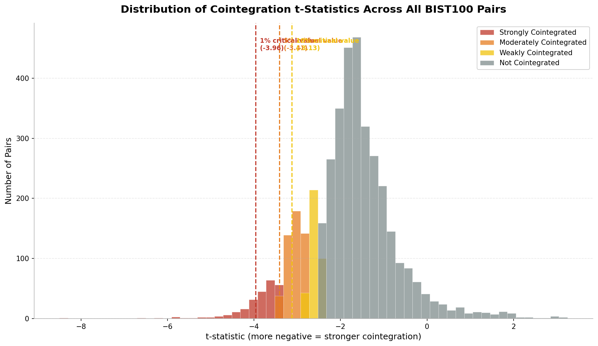

# bist-pairs-trading

A statistical analysis testing pairs of stocks in BIST 100 for cointegration, using Augmented Dickey-Fuller(ADF) and Engle-Granger methods. I have tested these on 5 years of historical data.

My main goal was to see if there was a potential for pairs trading strategies within the BIST 100.

---
## Key Findings and Results

I have tested a total of 4186 pair combinations (I had some problems with getting data for some stocks). I calcualted t-statistics's for each pair and compared it to critical values(1 percent, 5 percent, 10 percent), and grouped the pairs accordingly. Here is my results:

| Category | Pair Count | Percentage | Statistical Interpretation |
| :--- | :--- | :--- | :--- |
| **Not Cointegrated** | 3,085 | 73.7% | No stationary spread detected |
| **Weakly Cointegrated** | 357 | 8.5% | Rejection at 10% significance level |
| **Moderately Cointegrated** | 498 | 11.9% | Rejection at 5% significance level |
| **Strongly Cointegrated** | **246** | **5.9%** | Rejection at 1% significance level |

*Figure 1: Here you can see the results in a more simple way

*Figure 2: You can see the critical values used to classify pairs and where the pairs fall on a histogram

