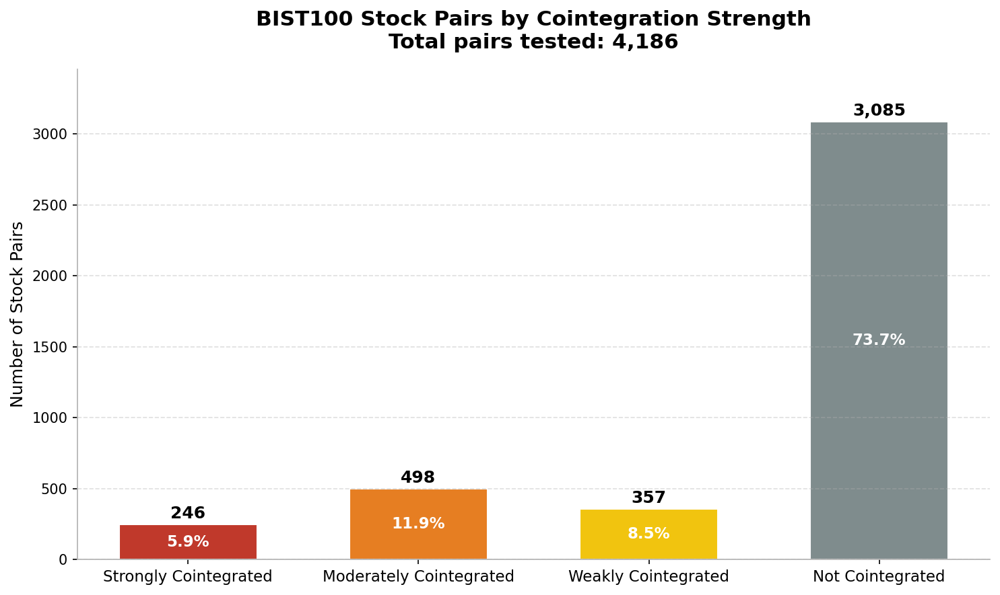
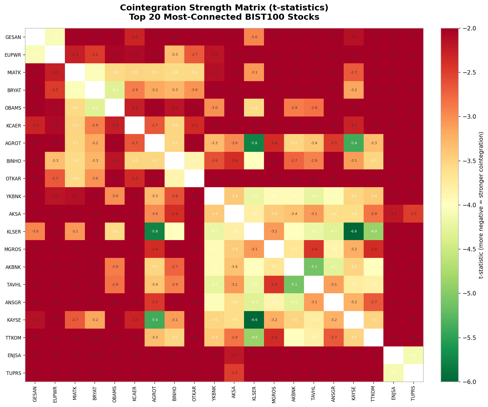
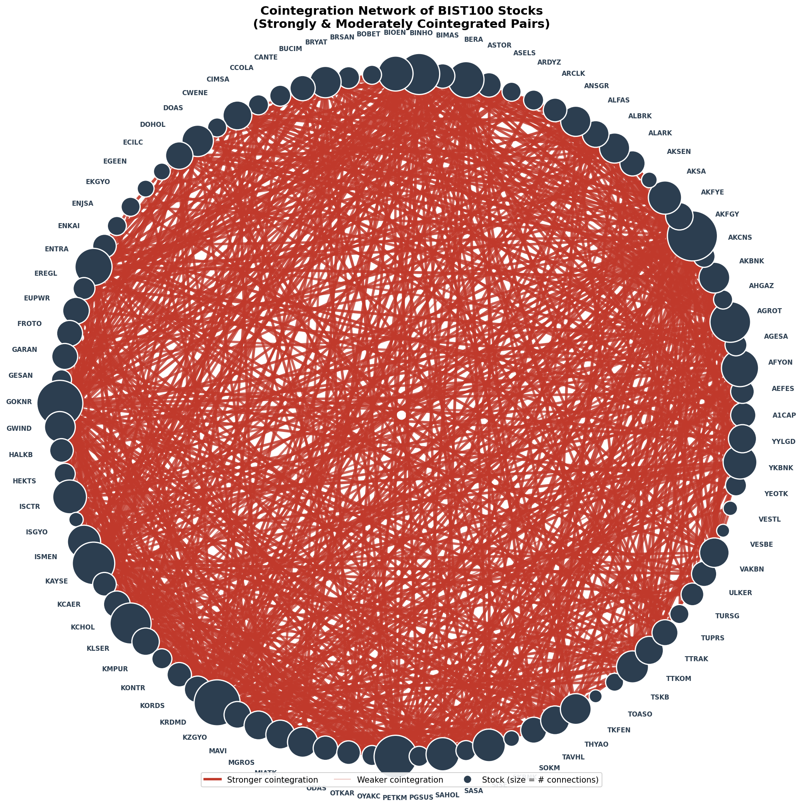
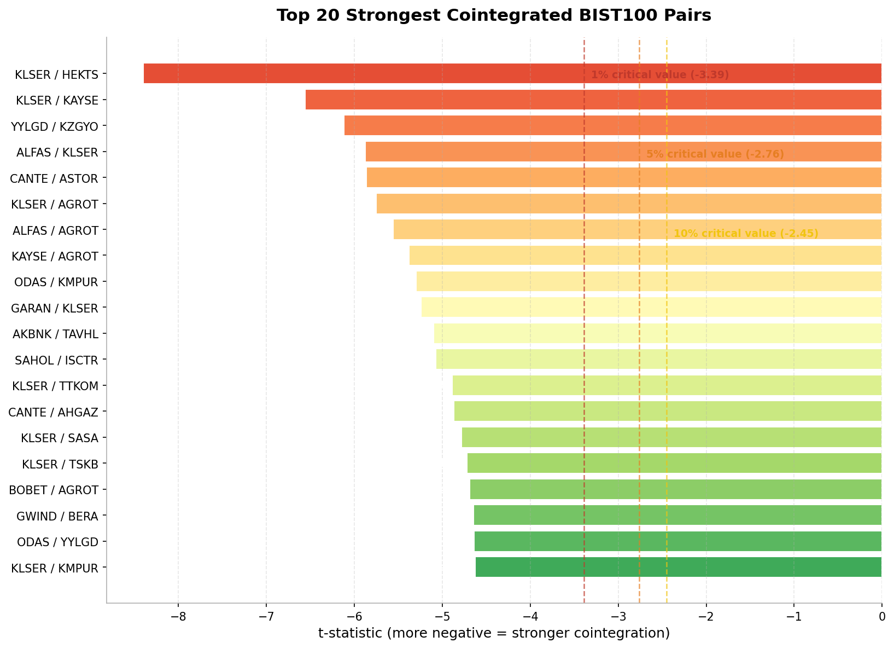

# bist-pairs-trading

A statistical analysis testing pairs of stocks in BIST 100 for cointegration, using Augmented Dickey-Fuller(ADF) and Engle-Granger methods. I have tested these on 5 years of historical data.

My main goal was to see if there was a potential for pairs trading strategies within the BIST 100.

---
## Key Findings and Results

I have tested a total of 4186 pair combinations (I had some problems with getting data for some stocks). I calcualted t-statistics's for each pair and compared it to critical values(1 percent, 5 percent, 10 percent), and grouped the pairs accordingly. Here is my results:

| Category | Pair Count | Percentage | Statistical Interpretation |
| :--- | :--- | :--- | :--- |
| **Not Cointegrated** | 3,085 | 73.7% | No stationary spread detected |
| **Weakly Cointegrated** | 357 | 8.5% | Rejection at 10% significance level |
| **Moderately Cointegrated** | 498 | 11.9% | Rejection at 5% significance level |
| **Strongly Cointegrated** | **246** | **5.9%** | Rejection at 1% significance level |

*Figure 1: Here you can see the results in a more simple way

*Figure 2: You can see the critical values used to classify pairs and where the pairs fall on a histogram

---
## Interpretation of the Results

The results suggest that there might be a possibility of using pairs trading strategies within the BIST 100 stocks. But these results must be treated with caution, because of the reasons:

* I have tested only the current stocks in the BIST 100, not the other ones that might be included in the 5-year period. This might lead to a survivorship bias.

*  After getting these results I have researched on the internet and learnt a few things. First of all, with 4186 pairs tested probability of finding false positives by chance is substantial. This can be a multiple-comparison problem. And I learned that if we assume all of the pairs are not cointegrated, **42** pairs will still pass the 1% treshold by chance.

*  I learned that we can use Bonferroni correction to match the number of pairs tested to get a stricter 1% t-statistical value of **-4.23**. Only 40 pairs pass the treshold given by the Bonferroni correction, they are given below:

| Rank | Pair | t-stat | Category |
|---|---|---|---|
| 1 | KLSER / HEKTS | -8.3991 | Strongly Cointegrated |
| 2 | KLSER / KAYSE | -6.5614 | Strongly Cointegrated |
| 3 | YYLGD / KZGYO | -6.1197 | Strongly Cointegrated |
| 4 | ALFAS / KLSER | -5.8785 | Strongly Cointegrated |
| 5 | CANTE / ASTOR | -5.8668 | Strongly Cointegrated |
| 6 | KLSER / AGROT | -5.7512 | Strongly Cointegrated |
| 7 | ALFAS / AGROT | -5.5586 | Strongly Cointegrated |
| 8 | KAYSE / AGROT | -5.3798 | Strongly Cointegrated |
| 9 | ODAS / KMPUR | -5.2955 | Strongly Cointegrated |
| 10 | GARAN / KLSER | -5.2440 | Strongly Cointegrated |
| 11 | AKBNK / TAVHL | -5.1003 | Strongly Cointegrated |
| 12 | SAHOL / ISCTR | -5.0727 | Strongly Cointegrated |
| 13 | KLSER / TTKOM | -4.8871 | Strongly Cointegrated |
| 14 | CANTE / AHGAZ | -4.8704 | Strongly Cointegrated |
| 15 | KLSER / SASA | -4.7819 | Strongly Cointegrated |
| 16 | KLSER / TSKB | -4.7198 | Strongly Cointegrated |
| 17 | BOBET / AGROT | -4.6892 | Strongly Cointegrated |
| 18 | GWIND / BERA | -4.6440 | Strongly Cointegrated |
| 19 | ODAS / YYLGD | -4.6392 | Strongly Cointegrated |
| 20 | KLSER / KMPUR | -4.6285 | Strongly Cointegrated |
| 21 | THYAO / KAYSE | -4.5857 | Strongly Cointegrated |
| 22 | THYAO / AFYON | -4.5285 | Strongly Cointegrated |
| 23 | KLSER / KZGYO | -4.5135 | Strongly Cointegrated |
| 24 | ALFAS / KMPUR | -4.5109 | Strongly Cointegrated |
| 25 | PETKM / GWIND | -4.4579 | Strongly Cointegrated |
| 26 | KONTR / AGROT | -4.4115 | Strongly Cointegrated |
| 27 | ODAS / AGROT | -4.4018 | Strongly Cointegrated |
| 28 | HEKTS / AGROT | -4.3866 | Strongly Cointegrated |
| 29 | YYLGD / KMPUR | -4.3455 | Strongly Cointegrated |
| 30 | ULKER / MAVI | -4.3311 | Strongly Cointegrated |
| 31 | KZGYO / AGROT | -4.3259 | Strongly Cointegrated |
| 32 | BRYAT / OBAMS | -4.3238 | Strongly Cointegrated |
| 33 | KLSER / ANSGR | -4.3191 | Strongly Cointegrated |
| 34 | ALFAS / KAYSE | -4.3096 | Strongly Cointegrated |
| 35 | CIMSA / ISMEN | -4.3066 | Strongly Cointegrated |
| 36 | AKBNK / ANSGR | -4.2887 | Strongly Cointegrated |
| 37 | KRDMD / AKCNS | -4.2857 | Strongly Cointegrated |
| 38 | GARAN / AGROT | -4.2756 | Strongly Cointegrated |
| 39 | GOKNR / A1CAP | -4.2560 | Strongly Cointegrated |
| 40 | YKBNK / TAVHL | -4.2372 | Strongly Cointegrated |

Important thing to note: Passing this treshold doesn't mean the pair is tradable or will stay cointegrated in the future. It does mean that these pairs are unlikely to be affected by the multiple-testing problem.

---
Disclaimer: This repository/post is for educational and statistical analysis purposes only. It demonstrates a cointegration test on historical BIST 100 data and does not constitute financial or investment advice.
